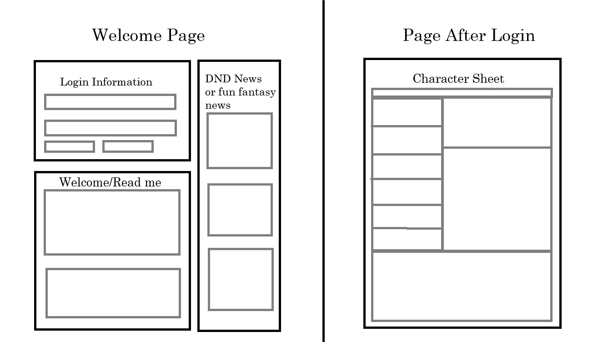

# D&D Character Sheet

> Get rid of the paper and embrace the digital.

## The Problem

Managing physical Dungeons & Dragons character sheets can be cumbersome. They are susceptible to being damaged, lost, or containing outdated or incorrect data due to miscalculations. This project aims to create a persistent, digital solution.

## Target Audience

This application is designed for players of **Dungeons & Dragons 5th Edition (5E)**.

---

## Technical Requirements

* **Stack:** Node.js backend, MySQL database
* **Architecture:** API + SPA (Node + React)

---

## Feature Breakdown

### Core (MVP) Features

* **Character Creation:** Users can create a new character.
* **Data Persistence:** All character sheets and information are savable.
* **View Information:** Users can easily read all inputted character information as well as details pertaining to various character aspects.
* **Update Stats:** Users can update character stats, inventory, and other details as their character progresses.
* **Delete:** Users can delete characters or items from a character sheet.

### Future Enhancements

* **Dice Rolling:** An integrated digital dice roller.
* **Status Effects:** A system for applying and tracking temporary buffs and debuffs.
* **Random Generators:**
    * Random Name Generator
    * Random Character Creator
* **Printability:** The ability to export and print a character sheet.
* **VTT Integration:** Integration with popular virtual tabletop simulators.
* **Sharing:** Options to share character sheets with others or make them public.
* **User Accounts:** Full login/authentication capability.
* **Beginner's Guide:** A step-by-step guide for users who are new to D&D character sheets, triggered by an initial prompt.
* **Past Changes:** A modal can be opened that will show past changes.

---

## Data Model Planning

### Core Entities

* **Users:** Manages login, sessions, and owns character sheets.
* **Character Sheets:** The central object where all character data is stored and manipulated.
* **API Data:** Fetches information about weapons, items, classes, and spells from an external D&D API.
* **Media Query (for Printing):** Converts the character sheet's web view into a print-friendly PDF format.

### Core Functionality (CRUD)

* **Create:** Users can create new character sheets.
* **Read:** Users can view all saved information on their character sheet as well as short excerpts for spells, items, etc.
* **Update:** Users can modify any information on the sheet, and the changes will be saved to the backend.
* **Delete:** Users have the ability to delete specific items or the entire character sheet.

---

## User Flow

---
## Wireframe

---

### How do they accomplish key tasks?

1.  Interactive fields and boxes will be visually distinct (e.g., highlighted with color) to indicate they can be modified.
2.  When a user selects an interactive element, relevant information and options will be presented in a pop-up or modal.
3.  The options presented to the user will be intelligently filtered based on previous decisions. For example, a level 1 wizard will only be shown level 1 spells to choose from.
4.  For new users, an optional guided experience will walk them through the character creation process step-by-step.
